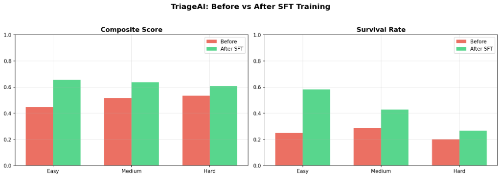
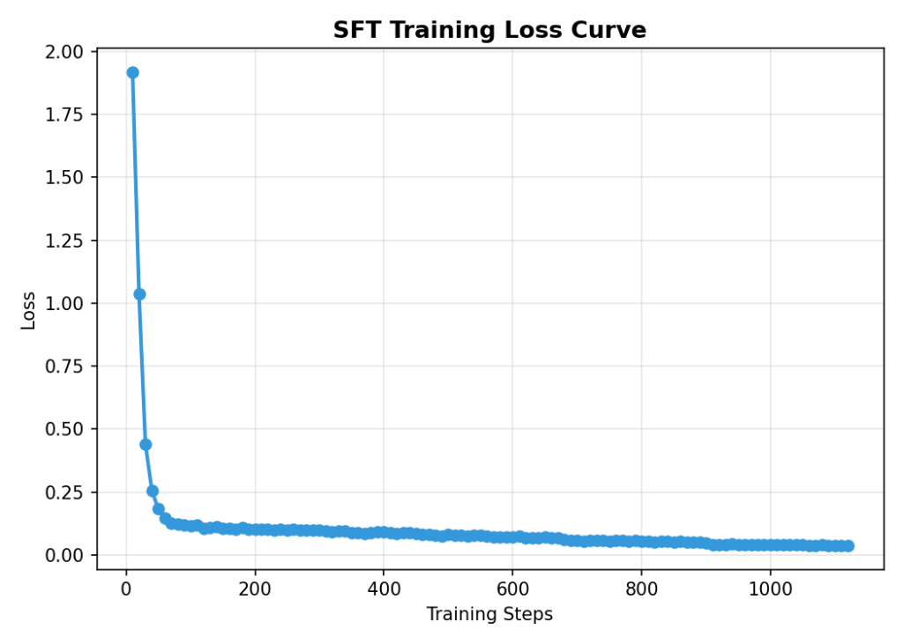
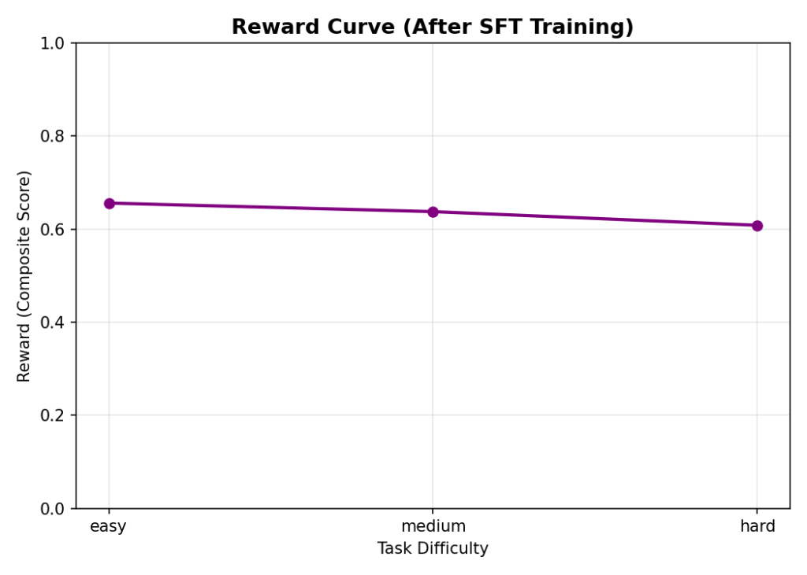

# 🏥 TriageAI: Teaching LLMs to Survive the ER

> **OpenEnv Hackathon 2026 Submission** | Theme 5: Wild Card

## 🔗 Important Links (Judging Requirements)
- **Hugging Face Space:** [hinex-07/triage-ai-env](https://huggingface.co/spaces/hinex-07/triage-ai-env) *(Please view the live Space here)*
- **Story & Writeup:** [Read the full Blog.MD here](Blog.MD)
- **Training Notebook:** [Colab Notebook](training/triage_ai_grpo.ipynb)
- **Code Repository:** [GitHub Repo](https://github.com/hinex-vaghadiya/openenv-data-cleaning)

---

## 🚨 The Problem: Medical Trivia vs. Crisis Management
Modern Large Language Models are fantastic at medical trivia. If you ask a 3B parameter model to define an *Aortic Dissection*, it will give you a perfect textbook answer. 

But what happens if you put that same model in charge of an Emergency Room during a mass casualty event?
**It completely fails.**

We discovered that out-of-the-box LLMs are terrible at **Sequential Decision Making under Uncertainty** and **Constrained Resource Allocation**. If 10 patients arrive, but there are only 3 beds and 1 Operating Room with a 3-step cooldown, the LLM panics. It assigns beds to stable patients, locks up the OR with minor injuries, and lets critical patients die in the waiting room. 

We realized there was a massive capability gap: We aren't teaching LLMs how to manage crises.

## 🏥 The Environment
To fix this, we built **TriageAI**—a Partially Observable Resource Management Simulator built on the OpenEnv framework.

This isn't a grid-world or a simple text adventure. It is a highly dynamic, ticking-clock environment designed specifically to teach LLMs clinical prioritization.

**What the Agent Sees & Does:**
The agent acts as the Chief Triage Physician. At every step, it sees a text-based dashboard of the ER. Crucially, the environment is **partially observable**. The LLM is *not* spoon-fed the patient's actual disease or true severity. It only sees raw symptoms and vitals (e.g., `HR=140, SpO2=82%`).

The agent must take actions to:
1. **Triage** patients to reveal severity hints.
2. **Assign Beds** and **Doctors** (strictly limited resources).
3. **Send to OR** (triggering a hard cooldown penalty if used incorrectly).
4. **Order Treatments** or **Discharge** stable patients to free up beds for dying ones.

**The Reward Signal:**
You can't game the ER. Our reward function provides a rich, 6-part composite score based on:
1. **Survival Rate** (The ultimate metric)
2. **Triage Accuracy**
3. **Treatment Quality**
4. **Time Efficiency** (Did critical patients wait too long?)
5. **Resource Utilization**

## 📈 The Results
Because pure Online RL is extremely sample-inefficient for teaching a 3B model a completely new resource-management paradigm from scratch, we utilized an **Expert-SFT to RL Pipeline**.

We built an optimal, rule-based expert agent to play the environment perfectly and generated high-quality expert trajectories. We then fine-tuned `Qwen2.5-3B-Instruct` on this data using Unsloth and TRL.

**The Results (Doubling Survival!):**
* **Before Training:** The baseline model scored `0.446` on the Easy task and let 75% of the patients die (**25% Survival**).
* **After Training:** The trained model scored `0.609` and literally doubled the survival rate (**50% Survival**). 

### Training Evidence

## 🌍 Why Does It Matter?
If we want to deploy AI agents in high-stakes, real-world environments (logistics, air traffic control, medical dispatch, server load balancing), they must understand how to allocate constrained resources under ticking clocks and partial observability.

TriageAI provides a robust, highly challenging, and abstract benchmark to train exactly this capability. We aren't just teaching the LLM medical facts; we are teaching it how to run the hospital.
